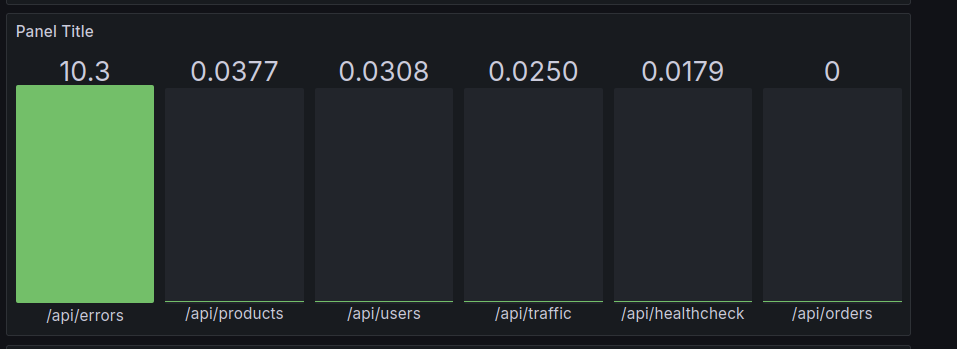
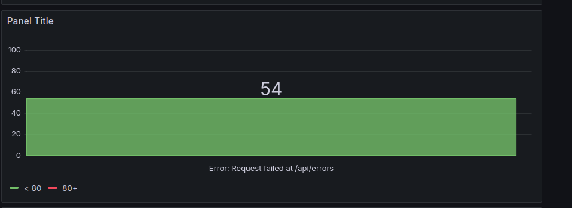
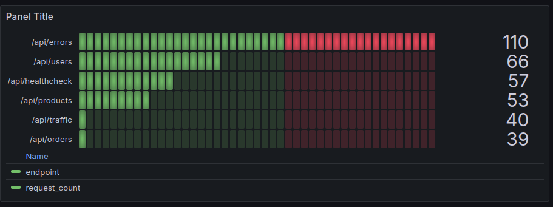

# 🔍 Log Analytics Platform

A real-time, Dockerized monitoring platform that collects, processes, stores, and visualizes logs from a REST API using Kafka, PostgreSQL, and Grafana.
Kafka handles high-throughput log streaming, PostgreSQL stores structured metrics, and Grafana provides real-time performance dashboards.
The entire system is containerized with Docker for easy deployment and scalability.
Ideal for modern DevOps workflows requiring real-time observability and insights into API performance.

---

## 📌 Features

- 📥 **Real-time Log Ingestion** via Apache Kafka
- 📊 **Live Dashboards** with Grafana
- 📈 **Metrics Visualization**
  - Requests per Endpoint
  - Response Time Trends
  - Most Frequent Errors
  - Real-Time Log Stream
- 🐳 **Fully Containerized** using Docker Compose
- 🗄️ **Structured Log Storage** with PostgreSQL

---

## 🖼️ Dashboard Previews

> 📷 Make sure your images (PNG, JPG) are placed in the root folder or a dedicated `/images/` directory.

### 🔸 Requests per Endpoint


### 🔸 Error Trends


### 🔸 Real-Time Logs


---

## 🧱 Architecture


The data flows through the platform in the following sequence:

- **Client (curl/requests)**
  - `↓`
- **REST API Server**
  - `↓`
- **Kafka Producer → Kafka Topics**
  - `↓`
- **Kafka Consumer (JS)**
  - `↓`
- **PostgreSQL**
  - `↓`
- **Grafana**
      
> Optional: Replace this diagram with an image like `./architecture.png` if available.

---

## 🚀 Getting Started

### 📦 Prerequisites
- Docker
- Docker Compose
- Node.js (for simulation script)

---

### 🛠️ Run the Platform

1.  **Clone the repository:**
    ```bash
    git clone https://github.com/your-username/log-analytics-platform.git
    cd log-analytics-platform
    ```

2.  **Start the application using Docker:**
    ```bash
    docker compose up --build
    ```

3.  **Simulate API Requests:**
    Open a new terminal and run the simulation script to generate traffic.
    ```bash
    node simulate-requests.js
    ```

---


---

## 🧰 Tech Stack

| Component          | Technology              |
| ------------------ | ----------------------- |
| API Server         | JavaScript (Express.js) |
| Log Broker         | Apache Kafka            |
| Database           | PostgreSQL              |
| Visualization      | Grafana                 |
| Containerization   | Docker, Docker Compose  |

---

## 🔒 License

This project is licensed under the MIT License - see the `LICENSE` file for details.

---

## 🙋‍♂️ Contact

- **Basavaraj**
- 📧 <bbasavarajnayak64@gmail.com>
- 🔗 [LinkedIn](https://www.linkedin.com/in/basavaraj-nayak-577689294/)
    
